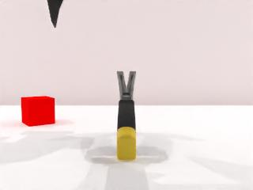
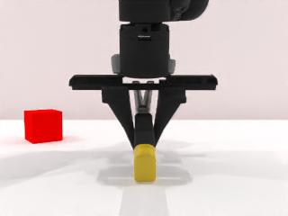
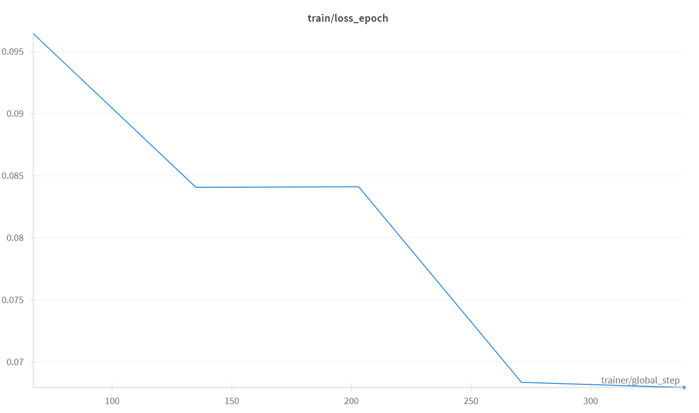
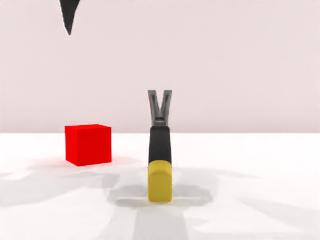
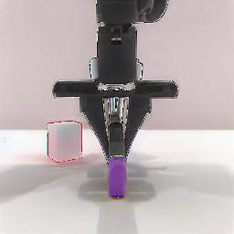
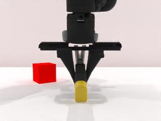
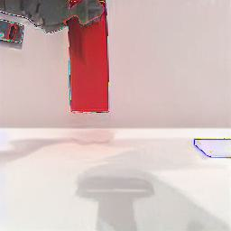
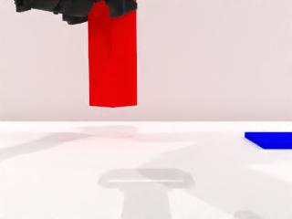
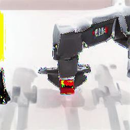

# InstructPix2Pix for Robot Manipulation

This project adapts InstructPix2Pix for robot manipulation tasks, allowing robots to follow visual instructions for object manipulation. The project includes data generation, model fine-tuning, and evaluation.


## 1. Data Generation

### 1.1 Generate Data with RobotWin

Run the `data_generation.ipynb` notebook to generate training data. You can modify the following parameters according to your needs:

```python
batch_size = 20      # Number of scenes to generate in parallel
total_episodes = 100  # Total number of scenes to generate
```

### 1.2 Download and Extract Dataset

After generation, download the zip data package (if you need), then extract it using:

```bash
python extract_data.py path/to/your/robot_dataset.zip path/to/output_dir
```

#### File Structure Before Extraction:
```bash
robot_dataset.zip
└── data/
    └── instruct-pix2pix-robot/
        ├── front/
        │   ├── prompt_0_0/
        │   │   ├── 0.jpg           # Input image
        │   │   ├── 1.jpg           # Target image
        │   │   └── prompt.json     # Contains instruction
        │   ├── prompt_0_1/
        │   └── ...
        └── head/
            ├── prompt_0_0/
            ├── prompt_0_1/
            └── ...
```

#### File Structure After Extraction:
```bash
output_dir/
├── front/
│   ├── prompt_0_0/
│   │   ├── 0.jpg           # Input image
│   │   ├── 1.jpg           # Target image
│   │   └── prompt.json     # Contains instruction
│   ├── prompt_0_1/
│   └── ...
└── head/
    ├── prompt_0_0/
    ├── prompt_0_1/
    └── ...
```

Example `prompt.json` content:
```json
{
  "input": "A robotic arm above a table with blocks",
  "edit": "handover the blocks",
  "output": "A robotic arm handing over blocks"
}
```

<div align="center">
  
  
</div>
<p align="center">
  <em>Examples from our training dataset: input image (left) and target image (right).</em>
</p>


## 2. Environment Setup and Model Preparation

### 2.1 Clone the InstructPix2Pix Repository

First, clone the original InstructPix2Pix repository and navigate to it:

```bash
git clone git clone https://github.com/timothybrooks/instruct-pix2pix.git
cd instruct-pix2pix
```

### 2.2 Create Conda Environment

```bash
conda env create -f environment.yaml
conda activate ip2p
```

### 2.3 Download Pre-trained Model

Download the pretrained models by running:
```bash
bash scripts/download_checkpoints.sh
```

The  model checkpoints `instruct-pix2pix-00-22000.ckpt` will be saved in the `./stable_diffusion/models/` directory.


## 3. Model Fine-tuning

### 3.1 Modify Configuration

Edit the `configs/train.yaml` file to specify your dataset and checkpoint paths:

1. Update the checkpoint path (if needed):
```yaml
model:
  base_learning_rate: 5.0e-05 
  target: ldm.models.diffusion.ddpm_edit.LatentDiffusion
  params:
    ckpt_path: ./stable_diffusion/models/instruct-pix2pix-00-22000.ckpt  # Update as needed
```

2. Update the dataset path:
```yaml
data:
  target: main.DataModuleFromConfig
  params:
    batch_size: 2
    num_workers: 2
    train:
      target: edit_dataset.EditDataset
      params:
        path: ./output_dir  # Path to your extracted dataset, eg. we use ./ft_data 
        split: train
        # ...
    validation:
      target: edit_dataset.EditDataset
      params:
        path: ./output_dir  # Path to your extracted dataset, eg. we use ./ft_data
        split: val
        # ...
```

### 3.2 Start Training

Run the following command to start fine-tuning:

```bash
python main.py --name default --base configs/train.yaml --train --gpus "0,"
```

#### Training Results Location

Training results will be saved in the `logs/` directory:

```bash
logs/
└── train_default/
│   ├── checkpoints/
│   │   ├── last.ckpt              # Latest checkpoint
│   │   └── epoch=X-step=Y.ckpt    # Checkpoints at specific epochs
│   └──  configs/								   # Configuration files                
├── image/												 # validation images
└── wandb/												 # wandb result 
```

Here is a visualization of our training loss:



## 4. Model Evaluation

After training, evaluate the model using:

```bash
python eval.py --data_dir path/to/your/eval_data --checkpoint_path path/to/your/checkpoint.ckpt --config_path path/to/your/fine_tuned_config.yaml --output_dir path/to/your/output_dir
```

For example, our command is:
```bash
python eval.py --data_dir ./eval_data --checkpoint_path ./logs/train_default/checkpoints/last.ckpt --config_path ./logs/train_default/configs/2025-05-04T22-16-01-project.yaml --output_dir ./predictions
```

### Evaluation Results Location

Evaluation results will be saved in the specified `output_dir` (e.g., `./predictions`):

```bash
./predictions/
├── results.txt                    # Overall metrics (SSIM, PSNR)
├── front_prompt_0_0_pred.jpg      # Predicted image for front view, prompt 0_0
├── front_prompt_0_1_pred.jpg      # Predicted image for front view, prompt 0_1
├── head_prompt_0_0_pred.jpg       # Predicted image for head view, prompt 0_0
└── ...
```

The `results.txt` file contains the average SSIM and PSNR scores across all test samples.

<div align="center">
  <div style="margin-bottom: 10px;">
    
    
    
  </div>

  <div style="margin-bottom: 10px;">
    
    
    
  </div>

  <div>
    
    
    
  </div>
</div>
<p align="center">
  <em>Examples from our evaluation dataset: input images (left), model outputs (middle), and target images (right).</em>
</p>


## References

For more information about RoboTwin and InstructPix2Pix model:

- [RoboTwin](https://github.com/TianxingChen/RoboTwin)
- [InstructPix2Pix](https://github.com/timothybrooks/instruct-pix2pix)

